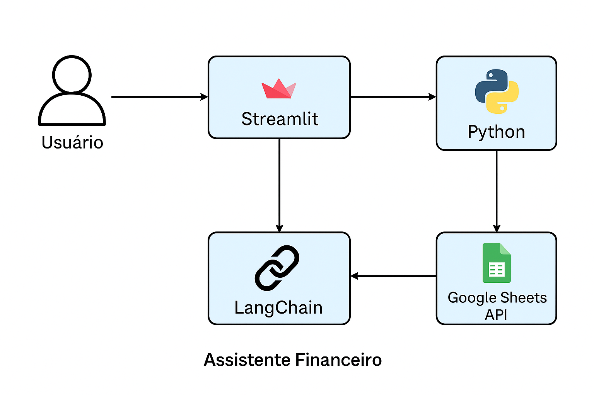

#[Arquitetura do TradeScope](assets/architecture.png)

## 📊 Visão Geral

**TradeScope** é um **painel de vendas inteligente** desenvolvido em **Python + Dash**, que agrega dados de vendas de múltiplas fontes (CSV, ERP, CRMs) e transforma esses dados em **KPIs, visualizações e insights automáticos**.  

O projeto foi projetado para pequenas e médias empresas que desejam **monitorar performance comercial, otimizar estoque e prever tendências de vendas**, de forma leve e extensível.  

> 💡 *A estrutura do projeto é preparada para integração com LangGraph / LangChain e geração automática de relatórios baseados em IA.*

---

## 🚀 Principais Funcionalidades

- 📈 **KPIs de vendas** — receita total, ticket médio, volume e pedidos.  
- 📊 **Visualização interativa de dados** — gráficos com Plotly e Dash.  
- 🧮 **Sugestões automáticas de estoque** — com base em volume de vendas.  
- 💬 **Geração de insights inteligentes** — análise automática do desempenho.  
- 🔗 **Estrutura pronta para IA corporativa** — compatível com LangGraph / LLMs.  
- 💾 **Dataset de exemplo** — CSV simples para testes e visualização.  

---

## 🧱 Arquitetura do Sistema

```

TradeScope/
├── data/
│   └── vendas_exemplo.csv           # Dados de teste
├── src/
│   ├── data_loader.py               # Carrega e normaliza CSVs
│   ├── kpi_calculator.py            # Cálculo de KPIs e sugestões de estoque
│   ├── insights_generator.py        # Geração de insights automáticos
│   └── visualizer.py                # Criação do dashboard Dash
├── assets/
│   └── architecture.png             # Diagrama de arquitetura
├── app.py                           # Inicialização do servidor Dash
├── requirements.txt                 # Dependências
├── .env.example                     # Variáveis de ambiente
└── README.md                        # Este arquivo

````

---

## 🧩 Stack Tecnológica

| Categoria | Ferramenta | Descrição |
|------------|------------|-----------|
| **Backend** | Python 3.10+ | Linguagem principal |
| **Data** | Pandas, NumPy | Manipulação e análise de dados |
| **Visualização** | Plotly, Dash | Dashboards interativos |
| **IA e Insights** | LangGraph (opcional) | Análise semântica e sugestões automatizadas |
| **Infraestrutura** | GitHub | Hospedagem e versionamento |
| **Futuro** | Power BI / Streamlit | Integração com ferramentas de BI |

---

## ⚙️ Instalação e Execução Local

### 1️⃣ Clonar o repositório
```bash
git clone https://github.com/seuusuario/TradeScope.git
cd TradeScope
````

### 2️⃣ Criar e ativar o ambiente virtual

```bash
python -m venv .venv
source .venv/bin/activate    # Linux / Mac
.venv\Scripts\activate       # Windows
```

### 3️⃣ Instalar dependências

```bash
pip install -r requirements.txt
```

### 4️⃣ Executar o dashboard

```bash
python app.py
```

Acesse em [http://localhost:8050](http://localhost:8050)

---

## 📈 Exemplo de Dataset (`data/vendas_exemplo.csv`)

```csv
date,order_id,product,category,quantity,unit_price,region
2025-09-01,1001,Perfume A,Beleza,2,120.00,Sudeste
2025-09-02,1002,Shampoo X,Higiene,1,25.00,Sul
2025-09-03,1003,Batom B,Beleza,3,15.00,Nordeste
2025-09-04,1004,AguaMineral,Alimentos,10,2.5,Centro-Oeste
2025-09-05,1005,Suco Y,Alimentos,5,6.0,Sul
2025-09-06,1006,Perfume A,Beleza,1,120.00,Sudeste
```

---

## 🔮 Como o TradeScope Funciona

1. **Coleta de Dados**
   O módulo `data_loader.py` carrega e limpa o dataset de vendas.

2. **Análise e KPIs**
   `kpi_calculator.py` calcula métricas como receita total, pedidos e ticket médio.

3. **Insights Automáticos**
   `insights_generator.py` identifica padrões e oportunidades, simulando o comportamento de uma IA analítica.

4. **Visualização Dinâmica**
   `visualizer.py` cria gráficos e painéis interativos com Dash.

5. **Execução via app.py**
   O `app.py` integra tudo e serve o dashboard localmente.

---

## 🌐 Diagrama da Arquitetura

O TradeScope segue uma arquitetura modular e leve:

```mermaid
graph TD
A[CSV / Fonte de Dados] --> B[Data Loader]
B --> C[KPI Calculator]
C --> D[Insights Generator]
D --> E[Dashboard (Dash + Plotly)]
E --> F[Usuário / Gestor]
```

---

## 🧭 Roadmap Futuro

✅ MVP Local (CSV + Dash)
🔄 Integração com APIs ERP/CRM
🤖 Insights via LangGraph / LLM
📤 Exportação automática de relatórios PDF
📊 Conexão com Power BI e Google Data Studio

---

## 🧪 Testes

Para rodar os testes:

```bash
pytest tests/
```

---

## 🤝 Contribuições

Contribuições são bem-vindas!

1. Faça um fork do projeto
2. Crie uma branch: `feature/nome-da-feature`
3. Envie um PR descrevendo a melhoria

---

## 🧾 Licença

Licença MIT — sinta-se livre para usar, modificar e distribuir.
© 2025 TradeScope — Desenvolvido por [CLAYTON RAMOS](https://github.com/cl4y70n)

---

## 🌟 Preview



---

## 💬 Contato

📧 Email: [claytonramos334@gmail.com](claytonramos334@gmail.com)
🐙 GitHub: [github.com/cl4y70n](https://github.com/cl4y70n)

```

---

Quer que eu **gere a imagem do painel TradeScope** (como se fosse um dashboard pronto com gráficos e KPIs) para você incluir no README também?  
Posso gerar uma imagem realista simulando o painel interativo do Dash.
```
